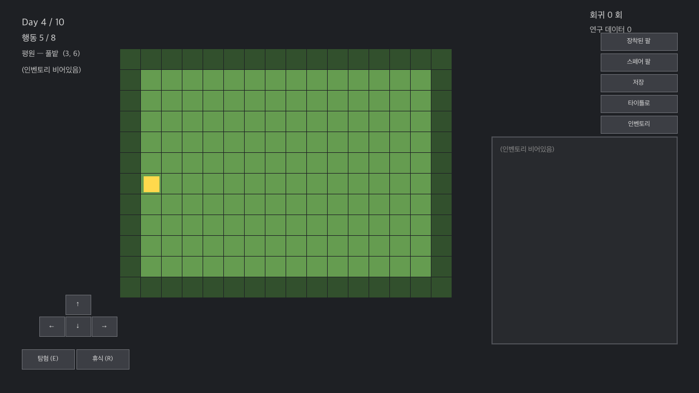
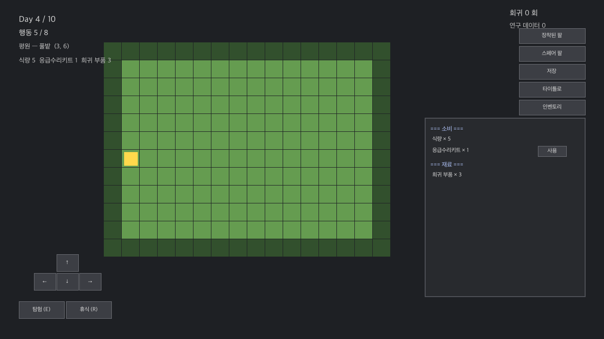
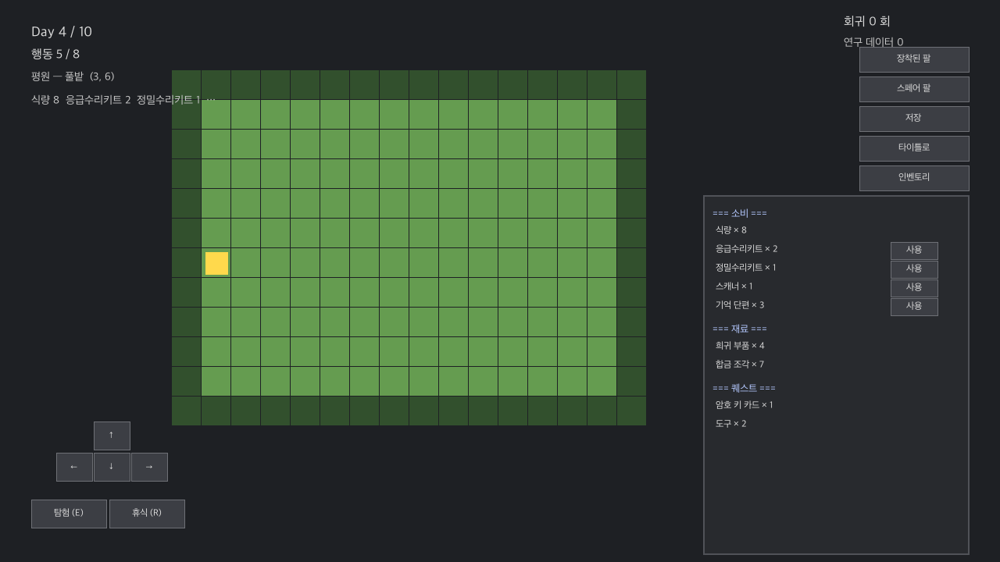

# 인벤토리 — RPG 결 spec

**날짜:** 2026-05-03
**원칙:** 단순 schema 우선 / 자료구조-행동 일치 / 헤드리스 자동 검증 / 자원 회귀 = 시점 복귀

---

## §0. 배경 + 결의 정정

### 0-1. 결의 핵심 차이

이전 결 (오해): **고정 슬롯** — 인벤토리에 모든 ITEMS 결이 미리 박혀있고 count 0~N.
```
inventory = { food: 3, potion: 1, rare_part: 0, scanner: 0, key: 0 }
```

본 결 (RPG): **빈 컨테이너** — 보유 중인 아이템만 박힘.
```
inventory = {}                # 시작 시 비어있음
add_item("magic_scroll", 1)
inventory == { magic_scroll: 1 }
consume_item("magic_scroll", 1)
inventory == {}               # 0 도달 = erase (보유 X)
```

**ITEMS const = 정의된 아이템 카탈로그**. 인벤토리 = **카탈로그 중 보유 중인 결만**. 게임 진행 결로 자유로이 추가.

### 0-2. RPG 결의 의미
- 카탈로그에 정의된 아이템이라면 어떤 결이든 인벤토리 추가 가능
- 보유 0 = 미보유 (dict 결로 키 없음)
- 새 아이템 추가 = ITEMS const 에 한 결만 박으면 됨, 코드 변경 X

### 0-3. 본 결의 범위
- 자원 결 = stack dict (id → count)
- 장비 결 = `arm_instances` 결로 분리 (현 결 그대로). 본 spec 의 인벤토리 = 자원 결만.
- 미래 결로 instance 결의 일반 아이템 (책 / 무기 등) 도입 시 별도 차.

### 0-4. 본 차에 박지 않는 결 (= 미래 차)
- **휴식 시 식량 자동 소모 / 페널티** — 게임 결의 결정 결, 본 차 X
- **슬롯 / 적 drop 결** — 보상 풀 차에서
- **knowledge 시스템 / 슬롯 의존 확장** — 별도 차
- **카운터 / 보상 풀** — 별도 차

본 차 = **인벤토리 시스템 결만** (자료구조 + helper + 사용 결 + UI + 세이브). 자유로이 add / consume / use 결 박힘 + 카탈로그 결로 미래 확장 결.

---

## §1. 자료구조

### 1-1. GameData

```gdscript
# game_data.gd
const CATEGORY_NAMES: Dictionary = {
    "consumable": "소비",
    "material":   "재료",
    "quest":      "퀘스트",
}

# ITEMS — 정의된 아이템 카탈로그.
# 본 결의 5 종은 시스템 검증의 placeholder. 컨텐츠 차에서 자유로이 확장.
# 새 아이템 추가 = 본 const 에 한 결 박으면 끝, 인벤토리 결의 다른 코드 변경 X.
const ITEMS: Dictionary = {
    "food": {
        "name": "식량",
        "category": "consumable",
        "scope": "big_run_default",
        "stack_max": 99,
        "use_event_id": null,
    },
    "repair_kit": {
        "name": "응급수리키트",
        "category": "consumable",
        "scope": "big_run_default",
        "stack_max": 99,
        "use_event_id": "use_repair_kit",
    },
    "rare_part": {
        "name": "희귀 부품",
        "category": "material",
        "scope": "big_run_default",
        "stack_max": 99,
        "use_event_id": null,
    },
    "scanner": {
        "name": "스캐너",
        "category": "consumable",
        "scope": "big_run_default",
        "stack_max": 99,
        "use_event_id": "use_scanner",
    },
    "key": {
        "name": "도구",
        "category": "quest",
        "scope": "internal_run",
        "stack_max": 99,
        "use_event_id": null,
    },
}
```

**stack_max = 99** 결로 통일 — RPG 결의 자유. 미래에 종합 한도 (예: 30 슬롯) 결 도입 가능.

### 1-2. RunManager.big_run_data

```gdscript
"inventory": Dict[String, int]    # 초기치 — 빈 dict 결로 시작
# _new_big_run 의 초기:
big_run_data["inventory"] = {}    # 빈 결로 시작 (사용자 결)
# 단 미래 결로 시작 결 신설 가능 — 일부 결로 시작 (예: { food: 3, potion: 1 })
```

### 1-3. RunManager.run_data

```gdscript
"inventory": Dict[String, int]    # 회차 가감 결 (매 회차 시작 시 big 의 사본)
"tools":     Dict[String, int]    # 회차 한정 자원 (매 회차 빔)

# _start_internal_run 결로:
run_data["inventory"] = big_run_data["inventory"].duplicate()   # 시점 복귀
run_data["tools"] = {}                                            # 회차 한정
```

### 1-4. 자료구조 결의 함의

- `inventory` 가 dict — 빈 결 / 한 종류 / 다양 결 다 자연 결.
- 새 아이템 추가 = `add_item("any_id", N)` 결로 dict 에 박힘.
- count 0 도달 = 자동 erase (보유 X = 키 없음).
- ITEMS 의 카탈로그 결 = 추가 가능한 결의 정의.

---

## §2. 흐름 — 인벤토리 helper

### 2-1. `add_item(item_id, amount)` — 인벤토리 추가
```gdscript
func add_item(item_id: String, amount: int = 1) -> bool:
    var def: Dictionary = GameData.ITEMS.get(item_id, {})
    if def.is_empty():
        push_warning("add_item: 알 수 없는 item_id '%s'" % item_id)
        return false
    var inv: Dictionary = _inventory_for_scope(def.get("scope", "big_run_default"))
    var stack_max: int = def.get("stack_max", 99)
    inv[item_id] = min(inv.get(item_id, 0) + amount, stack_max)
    state_changed.emit()
    return true
```

ITEMS 카탈로그에 정의되어 있으면 어떤 결이든 추가 가능.

### 2-2. `_consume_item(item_id, amount)` — 인벤토리 소모
```gdscript
func _consume_item(item_id: String, amount: int = 1) -> bool:
    var def: Dictionary = GameData.ITEMS.get(item_id, {})
    if def.is_empty(): return false
    var inv: Dictionary = _inventory_for_scope(def.get("scope", "big_run_default"))
    if inv.get(item_id, 0) < amount: return false
    inv[item_id] -= amount
    if inv[item_id] <= 0:
        inv.erase(item_id)   # 0 도달 시 키 삭제 (보유 X)
    return true
```

count 0 도달 시 erase — RPG 결의 "보유 X = 키 없음" 결.

### 2-3. `use_item(item_id)` — 명시 사용
```gdscript
func use_item(item_id: String) -> bool:
    if run_data.get("phase") != "map": return false
    var def: Dictionary = GameData.ITEMS.get(item_id, {})
    if def.is_empty(): return false
    var event_id = def.get("use_event_id", null)
    if event_id == null or event_id == "": return false
    if not _consume_item(item_id, 1): return false
    _begin_event_phase(event_id)
    state_changed.emit()
    return true
```

### 2-4. `_inventory_for_scope(scope)` — 컨테이너 분기
```gdscript
func _inventory_for_scope(scope: String) -> Dictionary:
    match scope:
        "big_run_default":
            if not run_data.has("inventory"): run_data["inventory"] = {}
            return run_data["inventory"]
        "internal_run":
            if not run_data.has("tools"): run_data["tools"] = {}
            return run_data["tools"]
        _:
            push_warning("_inventory_for_scope: 알 수 없는 scope '%s'" % scope)
            return {}
```

---

## §3. 신규 effect type (이벤트 결)

```gdscript
# RunManager.apply_event_action 의 match 분기에 추가:
"heal_body":           return _apply_heal_body(params)
"give_item":           return _apply_give_item(params)
"remove_item":         return _apply_remove_item(params)
"bump_initial_item":   return _apply_bump_initial_item(params)


func _apply_heal_body(params): return body_hp += amount, max cap
func _apply_give_item(params): return add_item(params.item, params.amount)
func _apply_remove_item(params): return _consume_item(params.item, params.amount)
func _apply_bump_initial_item(params):
    big_run_data["inventory"][item] += amount
    return true
```

신규 EVENTS 결 (라이브러리):
```gdscript
"use_repair_kit": { kind: "effect", effects: [{type: "heal_body", params: {amount: 25}}] }
"use_scanner":    { kind: "dialogue", lines: [...] }
```

---

## §4. UI — 목업 이미지

### 4-1. 빈 인벤토리 (시작 시)

`inventory == {}` 결.



- HUD 결 — "(인벤토리 비어있음)"
- 패널 토글 시 — "(인벤토리 비어있음)" 표시
- ITEMS 카탈로그 결과 무관 — 미보유 결로 표시 X

### 4-2. 일부 보유 (게임 중반)

`inventory == { food: 5, repair_kit: 1, rare_part: 3 }` 결.



- HUD 결 — 보유 결만 표시 ("식량 5  응급수리키트 1  희귀 부품 3")
- 패널 결 — 카테고리 자동 분리 (소비 / 재료)
- 사용 결 — `use_event_id != null` + 보유 > 0 결만 [사용] 버튼 표시

### 4-3. 다양한 RPG 결 (후반)

`inventory == { food: 8, repair_kit: 2, precision_kit: 1, scanner: 1, memory_fragment: 3, rare_part: 4, alloy_shard: 7, code_card: 1, key: 2 }` 결.



- 새 아이템 (precision_kit / memory_fragment / alloy_shard / code_card) = ITEMS 카탈로그에만 박혀있으면 자유로이 인벤토리 추가
- 카테고리 자동 정렬 (소비 / 재료 / 퀘스트)
- 사용 가능 결만 [사용] 버튼

### 4-4. UI 결의 핵심
- **모든 결이 ITEMS 카탈로그 결 자동** — 새 아이템 추가 = ITEMS 한 결, UI 결 변경 0
- **보유 > 0 만 표시** — RPG 결의 자연
- **카테고리 결 자동 정렬** — `CATEGORY_NAMES` const 의 결 한국어 매핑

---

## §5. 회귀 결 (시점 복귀)

### 5-1. 자원 회귀 결
- `big_run_data["inventory"]` = 초기치 (RESEARCH 만 변경)
- `run_data["inventory"]` = 매 회차 시작 시 big 의 사본
- 회귀 = `_start_internal_run` 의 `duplicate()` 결로 자동 시점 복귀

### 5-2. 회차 한정
- `run_data["tools"]` = 매 회차 빈 dict
- 회귀 시 자동 빔

### 5-3. RESEARCH 결의 초기치 강화
```gdscript
"bump_food_initial": {
    "type": "bump_initial_item",
    "params": { "item": "food", "amount": 2 },
    ...
}
```
다음 회차 시작 시 자동 반영.

---

## §6. 단계별 사이클 분해

### 6-1. 사이클 표 (총 5 사이클)

| # | 사이클 | unit | 검증 |
|---|---|---|---|
| **I-1** | ITEMS const + 자료구조 (빈 dict 결) | 4 | 회귀 251 + schema 13 |
| **I-2** | helper (add_item / _consume_item / use_item) — erase 결 포함 | 5 | actions 17 |
| **I-3** | effect type 4 + EVENTS (use_repair_kit / use_scanner) | 5 | actions +13 |
| **I-4** | UI 인벤토리 (빈 결 → 일부 결 / RPG 결 표시) | 5 | visual 9 |
| **I-5** | 세이브 마이그레이션 | 3 | save 13 |

= 5 사이클 / 22 unit, 약 4~6 시간.

휴식 시 식량 자동 소모 결은 미래 차 (게임 결 결정 후).

### 6-2. 사이클 1 (I-1) — ITEMS const + 자료구조 (빈 dict)

| # | unit | 완료 조건 |
|---|---|---|
| 1.1 | `ITEMS` const + `CATEGORY_NAMES` 신설 (5 종) | `GameData.ITEMS.size() == 5` 외 정합 |
| 1.2 | `_new_big_run` 의 `inventory = {}` 빈 dict | 큰 런 시작 시 빈 dict |
| 1.3 | `_start_internal_run` 의 `inventory` / `tools` 신설 | 회차 시작 시 빈 dict (`big.inventory.duplicate()`) |
| 1.4 | 자동 검증 — schema 13 | PASS |

### 6-3. 사이클 2 (I-2) — helper 결 (erase 결 포함)

| # | unit | 완료 조건 |
|---|---|---|
| 2.1 | `_inventory_for_scope` | scope 분기 정상 |
| 2.2 | `add_item` — 알 수 없는 id 거부, stack_max cap | 정합 |
| 2.3 | `_consume_item` — 부족 거부, **0 도달 시 erase** | 정합 |
| 2.4 | `use_item` — phase / 정의 / use_event_id null / 보유 0 거부 | 정합 |
| 2.5 | 자동 검증 — actions 17 | PASS |

### 6-4. 사이클 3 (I-3) — effect type + EVENTS

| # | unit | 완료 조건 |
|---|---|---|
| 3.1 | `apply_event_action` 의 match 4 분기 추가 | 분기 작동 |
| 3.2 | `_apply_*` 4 함수 신설 | 효과 정상 |
| 3.3 | EVENTS 의 `use_potion` (effect) / `use_scanner` (dialogue) | 발화 결 정상 |
| 3.4 | use_potion 사용 → potion -1 + body_hp +25 + erase 결 | 정합 |
| 3.5 | 자동 검증 — actions +13 | PASS |

### 6-5. 사이클 4 (I-4) — UI

| # | unit | 완료 조건 |
|---|---|---|
| 4.1 | 토글 버튼 + 패널 + 컨테이너 결 | 토글 정상 |
| 4.2 | 카테고리 자동 결 (`CATEGORY_NAMES` 활용) | 정렬 정상 |
| 4.3 | 보유 > 0 만 표시 / 사용 버튼 (`use_event_id != null` + 보유 > 0) | 정합 |
| 4.4 | HUD 결 — 보유 결만 표시 | 정합 |
| 4.5 | 시각 검증 (스크린샷 3 컷) | PASS |

### 6-6. 사이클 5 (I-5) — 세이브 마이그레이션

| # | unit | 완료 조건 |
|---|---|---|
| 5.1 | `_migrate_save` 에 inventory / tools 결 신설 (옛 세이브 = 빈 dict 박힘) | 정합 |
| 5.2 | 직렬화 round-trip | PASS |
| 5.3 | 자동 검증 — save 13 | PASS |

---

## §7. 테스트 분해

### 7-1. 신규 3 검증 스크립트

| 스크립트 | 항목 | 적용 |
|---|---|---|
| `test_inventory_schema.gd` | ~13 | ITEMS / 빈 dict / scope / 회귀 시점 복귀 |
| `test_inventory_actions.gd` | ~30 | helper / effect / use_item / **erase 결** |
| `test_inventory_save.gd` | ~13 | 직렬화 + 마이그레이션 |
| **합** | **~56** | |

(시각 검증 — `test_inventory_visual.gd` 결 별도, ~9 항목)

### 7-2. 누적
- 기존 251 + 신규 ~56 + 시각 ~9 = **~316 PASS**

### 7-3. 핵심 검증 결 (RPG 결의 검증)
- `add_item("magic_scroll", 1)` 결로 카탈로그 결의 어떤 아이템이든 추가 가능
- `_consume_item` 의 0 도달 시 erase
- 빈 dict 결 (시작 시 / 모두 erase 후)
- 회귀 시 시점 복귀 (run["inventory"] = big["inventory"].duplicate())

---

## §8. 결정 자리

### 8-1. 초기치 결 — **빈 dict** (확정)
사용자 정정 결로 — `big_run_data["inventory"] = {}` 시작.
- 옛 결 (식량 3 / 약초 1 박힘) → 폐기
- 게임 진행 결로 add_item / 슬롯 drop / 이벤트 effect 결로 박힘
- RESEARCH 의 `bump_initial_item` 결로 빅 런 통과 강화 가능

### 8-2. stack_max — **99 통일** (확정)
RPG 결의 자유. 종합 한도 결은 미래 차.

### 8-3. 식량 자동 소모 정책 — 본 차 X
미래 차 (게임 결 결정 후). 본 차의 휴식 결은 옛 결 그대로 (식량 결 무관).

### 8-4. 카테고리 결 — `consumable` / `material` / `quest` 만
미래 결로 `equipment` / `book` / `accessory` 등 추가. 본 차 3 종.

### 8-5. 회귀 시 자원 결 — 시점 복귀 (확정)
사용자 정정 결.

---

## §9. 다음 액션

GO 신호 → I-1 사이클 진입.

매 사이클 종료 시 검증 PDF 결로 사용자 합의. 다중 맵 결과 같은 패턴.

I-1 ~ I-6 종료 후 컨텐츠 자동 채움 결로 다음 시스템 (knowledge / 의존 / 카운터 / drops).

---

## §10. 본 spec 의 핵심 결

- **ITEMS = 카탈로그**. 인벤토리 = 보유 결.
- **빈 dict 결로 시작** — 게임 진행 결로 자유 추가.
- **0 도달 시 erase** — 보유 X = 키 없음.
- **카테고리 자동 결** — 새 카테고리 추가 시 `CATEGORY_NAMES` 결 한 결만.
- **사용 결 = `use_event_id`** 결로 이벤트 발화 통일.
- **회귀 = 시점 복귀** — 자원 결만, knowledge 는 빅 런 통과 (미래 차).

---

## §11. 미해결 — 본 차 이후

- knowledge 시스템
- 슬롯 의존 확장 (depends_on_seen + depends_on_knowledge + depends_on_items)
- 카운터 (적 처치 / 발견 누적)
- 보상 풀 (적 / 슬롯의 weighted drops)
- 추가 effect type (learn / reveal_nearby_slots 등)

각각 인벤토리 결과 같은 결로 사이클 분해.
